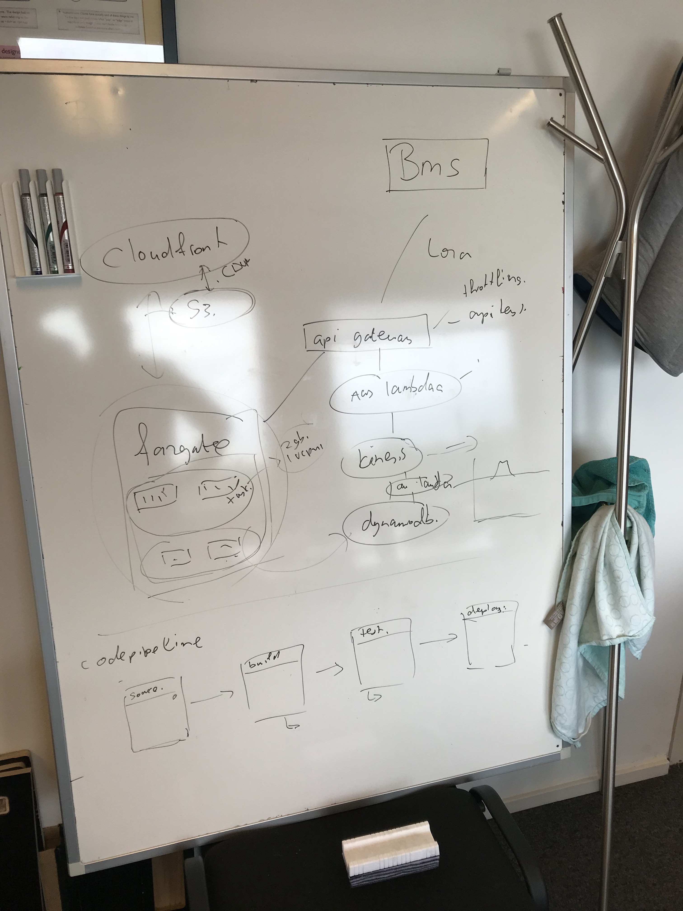
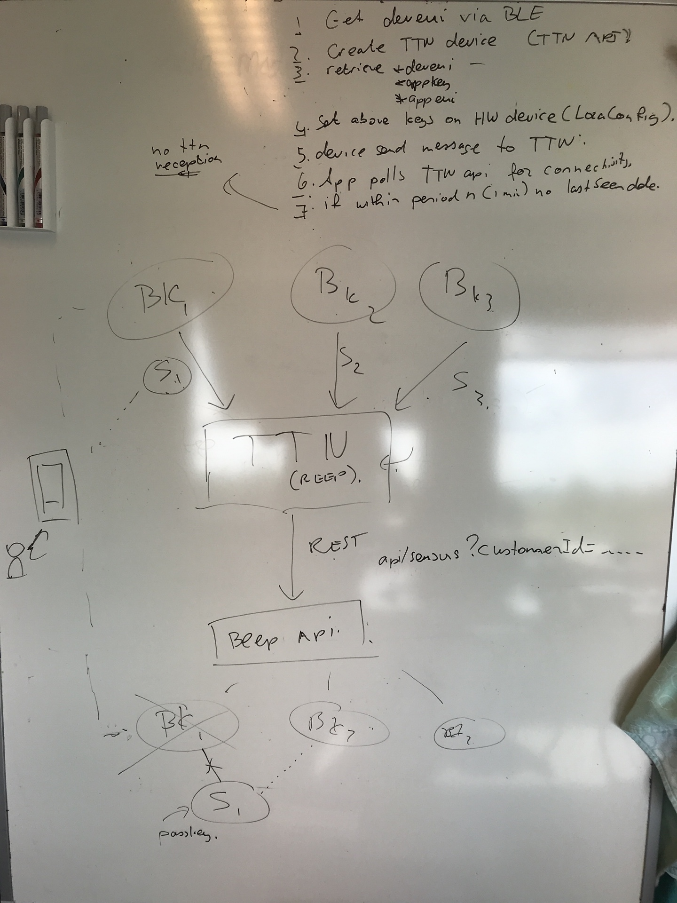

# BEEP Notes 2019-08-02

George, Pim

## AWS stack

See image whiteboard

## Native app

Functions

1. System configuration
	* Bluetooth direct connection
	* LoRa network commissioning
	  * Beep TTN - Single click integration (one or more standard providers)
    * Get Device EUI
	    * Set network credentials
	    * Send LoRa message
	    * Check for payload message and signal strength 
	  * Custom provider (e.g. KPN)
	  * No LoRa
2. Dataset download
   * And upload to Beep API
3. Webview VUE pages
  * With router on-line
  * Without router in native vue
4. Native implementation of views by feature
  * Mobile device interaction at apiary
    * Workflow of actions, reminders, events
      * Text to speech
    * Speech to inspections
      * Piece by piece
      * visuals and beeps on acknowledge at correctly 
    * Scanning paper inspections
      * Check for SDK's 
      * Use microdots in printing PDF generation
      * 

## Data lake

Front-end interface on open data

## Alarms & notifications

Build logic in DynamoDB streams - Lambda - SNS - App push notification?

# Domain model

## Apiary/Hive

* Take periodical snapshots of object tree (from apiary down)
* Ability to delete snapshots in case of error

## LoRa/data API

* API input by API key Authentication
* For device protection
  * Access to apiary within BLE range may not allow BLE connection
  * Prohibit flashing firmware for a stolen device
    * BLE passkey, save in Beep API for lost phones
    * Set automatically after first successful LoRa commissioning
    * In hardware testing phase, do not set pass key
  * Sell device
    * Transfer device to other Beep user
    * Seller deletes Beep accounts, device is orphaned, then another Beep user may link sensor to Beep account by providing visible ID, of NFC tag. After linking to Beep user, BLE passcode is available for use
  * Stolen device, still posts location:
    * Use passkey after first BLE pair Nordic nRF52840
  * Access to apiary, and device with magnet may not allow BLE connection?
    * Accept only one BLE connection
    * If passkey is used, how to reset if new owner, or passkey lost?
      * 

